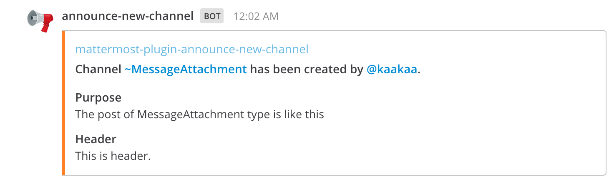

# Mattermost Plugin Announce New Channel 

Notify when a channel is created.

## Settings

* **Message type**: The type of message (**Simple** or **MessageAttachments**)

#### Simple

#### Message Attachments

## License

[LICENSE](./LICENSE)

